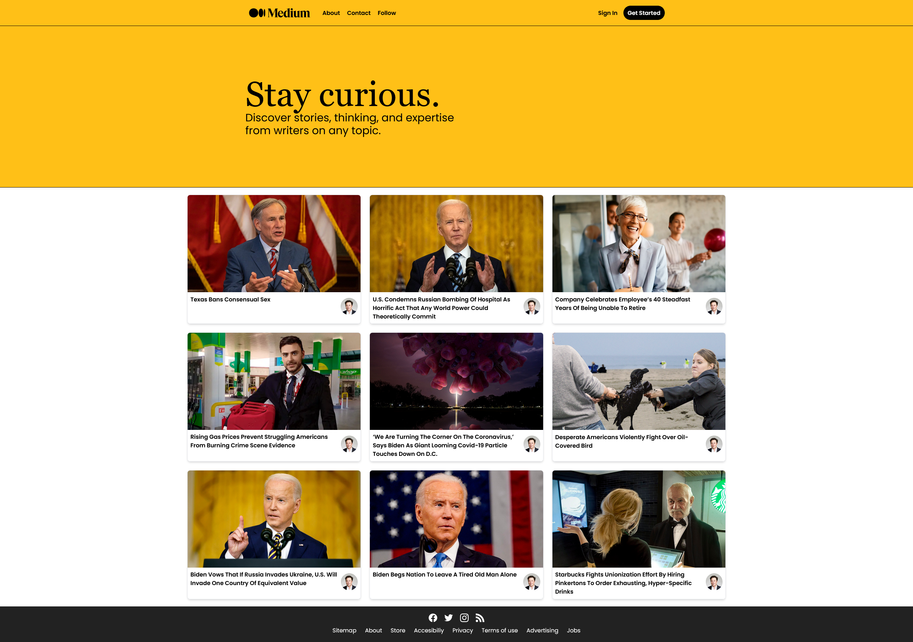
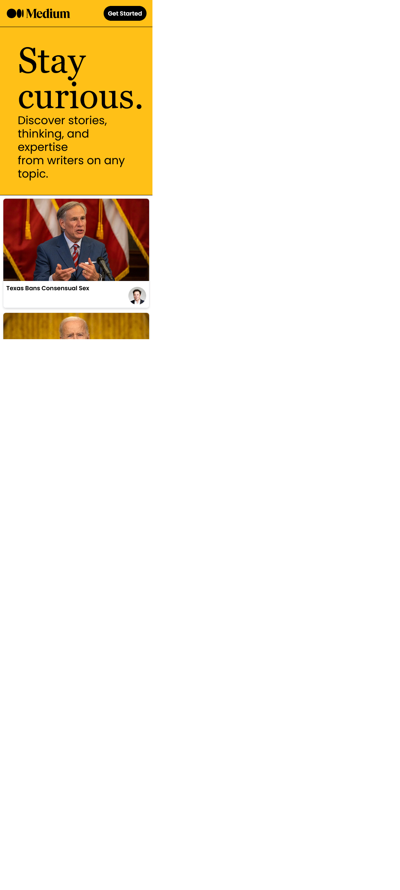

# Medium Clone made with Next.js + TailwindCSS + SanityBackend

This is a medium clone built as a learning/portfolio project.

Made following https://www.youtube.com/watch?v=I2dcpatq54o&

Live Demo link: https://medium-2-0-liart.vercel.app/

## Previews

### Desktop view

### Tablet view

### Mobile view
